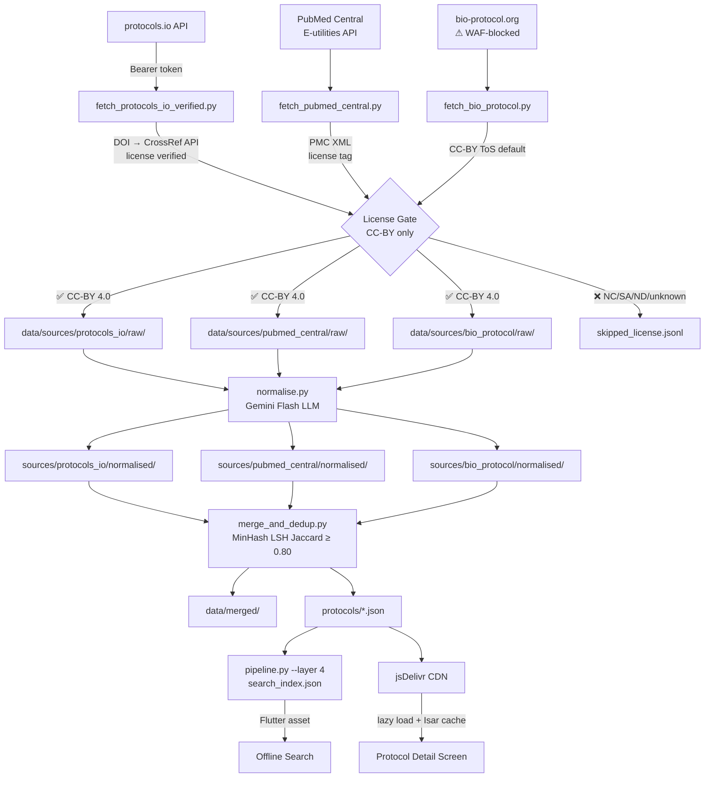

# labi-protocols

Data infrastructure for [Labi](https://github.com/itsgurmailsingh-png/labi) — an offline-first lab protocol assistant.

This repo runs a multi-source, license-verified pipeline that ingests raw protocol data, verifies every license via external registries, normalises to a canonical schema via LLM, deduplicates across sources, and publishes to a CDN consumed by the Flutter app.

---

## Graphical Abstract

```
╔══════════════════════════════════════════════════════════════════════════════╗
║                     LABI PROTOCOL DATA PIPELINE  v2                        ║
╠══════════════════════════════════════════════════════════════════════════════╣
║                                                                              ║
║  SOURCE 1         SOURCE 2        SOURCE 3      SOURCE 4       SOURCE 5     ║
║  protocols.io     PubMed Central  Zenodo        figshare       OpenWetWare  ║
║  ⚠️ FROZEN        NCBI E-utils    REST API      REST API       MediaWiki    ║
║  6,291 done       CC-BY XML       CC0+CC-BY     CC-BY          CC-BY-SA     ║
║        │                       │                        │                   ║
║        ▼                       ▼                        ▼                   ║
║  ┌─────────────┐        ┌─────────────┐         ┌─────────────┐            ║
║  │  fetch_     │        │  fetch_     │         │  fetch_     │            ║
║  │  protocols  │        │  pubmed_    │         │  bio_       │            ║
║  │  _io_       │        │  central.py │         │  protocol.py│            ║
║  │  verified.py│        │             │         │             │            ║
║  └──────┬──────┘        └──────┬──────┘         └──────┬──────┘            ║
║         │                      │                        │                   ║
║         │ CrossRef DOI         │ PMC XML                │ CC-BY             ║
║         │ verification         │ <license> tag          │ (ToS default)     ║
║         │ (per protocol)       │ (per article)          │                   ║
║         │                      │                        │                   ║
║         ▼                      ▼                        ▼                   ║
║  ┌─────────────────────────────────────────────────────────────┐            ║
║  │              LICENSE GATE  (hard filter)                    │            ║
║  │                                                             │            ║
║  │   creativecommons.org/licenses/by/4.0/  →  ✅  KEEP        │            ║
║  │   .../by-nc/...   .../by-sa/...         →  ❌  DISCARD     │            ║
║  │   No license / DOI not in CrossRef      →  ❌  DISCARD     │            ║
║  └─────────────────────────────────────────────────────────────┘            ║
║         │                      │                        │                   ║
║         ▼                      ▼                        ▼                   ║
║  data/sources/         data/sources/          data/sources/                 ║
║  protocols_io/raw/     pubmed_central/raw/    bio_protocol/raw/             ║
║                                                                              ║
║  ─────────────────────────────────────────────────────────────────────────  ║
║                                                                              ║
║                        LAYER 2: NORMALISE                                   ║
║                        scripts/normalise.py                                 ║
║                                                                              ║
║   raw source JSON  →  Gemini Flash (offline batch LLM)  →  Labi schema     ║
║                                                                              ║
║   Extracts: title · author · category · estimated_time_mins                 ║
║             materials · steps (with is_critical + timers)                   ║
║                                                                              ║
║   data/sources/{source}/normalised/{id}.json                                ║
║                                                                              ║
║  ─────────────────────────────────────────────────────────────────────────  ║
║                                                                              ║
║                       LAYER 3: MERGE + DEDUP                                ║
║                       scripts/merge_and_dedup.py                            ║
║                                                                              ║
║   MinHash LSH (128 permutations, Jaccard ≥ 0.80)                           ║
║   Source priority:  bio_protocol > pubmed_central > vendor > protocols_io   ║
║   Conflict rule:    license_verified=true wins · then more steps wins       ║
║                                                                              ║
║   data/merged/{protocol_id}.json                                            ║
║   protocols/{protocol_id}.json   ← public CDN folder                       ║
║                                                                              ║
║  ─────────────────────────────────────────────────────────────────────────  ║
║                                                                              ║
║                       LAYER 4: INDEX                                        ║
║                       scripts/pipeline.py --layer 4                         ║
║                                                                              ║
║   search_index.json  ← compact metadata only, bundled Flutter asset         ║
║                                                                              ║
║  ─────────────────────────────────────────────────────────────────────────  ║
║                                                                              ║
║                       DELIVERY                                              ║
║                                                                              ║
║   jsDelivr CDN  →  Flutter app                                              ║
║   search_index.json   bundled asset   →  offline instant search             ║
║   protocols/*.json    lazy CDN fetch  →  protocol detail (cached in Isar)   ║
║                                                                              ║
╚══════════════════════════════════════════════════════════════════════════════╝
```

---

## Mermaid Diagram



---

## Directory Structure

```
labi-protocols/
│
├── protocols/                          ← PUBLIC: CDN-served protocol JSONs
│   └── {protocol_id}.json
│
├── search_index.json                   ← PUBLIC: compact metadata index
│
├── data/
│   ├── archive/
│   │   └── protocols_io_unverified/    ← OLD data, license unconfirmed, NOT distributed
│   │       └── README.txt              ← explains why archived
│   │
│   ├── sources/
│   │   ├── protocols_io/
│   │   │   ├── raw/                    ← CrossRef-verified CC-BY 4.0 raw JSON
│   │   │   ├── normalised/             ← Labi schema, LLM-normalised
│   │   │   └── skipped_license.jsonl  ← protocols that failed license check
│   │   │
│   │   ├── pubmed_central/
│   │   │   ├── raw/                    ← CC-BY confirmed from PMC XML <license>
│   │   │   └── normalised/
│   │   │
│   │   ├── bio_protocol/
│   │   │   ├── raw/                    ← CC-BY per bio-protocol.org ToS
│   │   │   └── normalised/
│   │   │
│   │   └── vendor/
│   │       ├── raw/                    ← Vendor protocols (Thermo Fisher etc.)
│   │       └── normalised/
│   │
│   └── merged/                         ← post-dedup merged protocols
│
├── scripts/
│   ├── pipeline.py                     ← orchestrator: run all 4 layers
│   ├── normalise.py                    ← Layer 2: raw → Labi schema via Gemini
│   ├── merge_and_dedup.py              ← Layer 3: MinHash LSH dedup across sources
│   │
│   └── sources/
│       ├── fetch_protocols_io_verified.py  ← protocols.io + CrossRef gate
│       ├── fetch_pubmed_central.py          ← PMC E-utilities + XML license gate
│       └── fetch_bio_protocol.py           ← bio-protocol.org scraper (WAF issue)
│
├── requirements.txt
└── README.md
```

---

## Scripts Reference

### `scripts/sources/fetch_protocols_io_verified.py`
Fetches public protocols from the protocols.io v3 API and verifies each license via CrossRef DOI metadata before saving.

**How it works:**
1. Searches protocols.io with 25 broad lab keywords (`extraction`, `PCR`, `RNA`, `western blot`, `ELISA`, `cloning`, etc.) — the API requires a search term, so broad keywords give full coverage
2. For each protocol, extracts the DOI field
3. Queries `api.crossref.org/works/{doi}` and reads the `license[0].URL` field
4. Saves to `data/sources/protocols_io/raw/` **only** if license URL contains `creativecommons.org/licenses/by/` without `/nc`, `/sa`, or `/nd`
5. Logs all discarded protocols to `skipped_license.jsonl` with reason

**License authority:** CrossRef DOI registry — the canonical permanent record of what license was declared at DOI registration time.

**Key config:**
```bash
PROTOCOLS_IO_TOKEN=...   # from protocols.io/developers
MAX_PROTOCOLS=2000       # default
```

---

### `scripts/sources/fetch_pubmed_central.py`
Fetches open-access lab protocols from PubMed Central using NCBI E-utilities.

**How it works:**
1. ESearch for `protocol[Title] OR method[Title]` in PMC open access articles
2. EFetch full XML for each article
3. Parses `<ali:license_ref>` element (NISO ALI namespace) for license URL
4. Keeps only `creativecommons.org/licenses/by/` (not NC/SA/ND)
5. Extracts title, author, abstract, method section paragraphs as `steps_raw`

**Rate limiting:**
- Without `NCBI_API_KEY`: 3 req/sec (0.34s delay)
- With `NCBI_API_KEY`: 10 req/sec (0.11s delay)

**License authority:** The `<license>` element in the PMC article XML is deposited by the publisher at submission — it reflects what the authors/publisher declared.

---

### `scripts/sources/fetch_bio_protocol.py`
Scraper for bio-protocol.org — a peer-reviewed, CC-BY 4.0 protocol journal.

**Status: blocked by SafeLine WAF (HTTP 468).** The sitemap works (4,944 protocols found), but protocol pages return 468 for server-side requests. Headless browser (Playwright) approach pending.

**License authority:** bio-protocol.org Terms of Service explicitly state all published content is CC-BY 4.0.

---

### `scripts/normalise.py`
Converts raw source JSON to the canonical Labi protocol schema using Gemini Flash.

**Runs per-source or all at once:**
```bash
python3 scripts/normalise.py                         # all sources
python3 scripts/normalise.py --source pubmed_central # one source
```

**What the LLM does:**
- Extracts clean title, author, category (from 13 canonical options)
- Estimates total time in minutes
- Extracts materials list (reagents + equipment)
- Converts raw step text into structured step objects with `is_critical` flags

**Fallback:** If `GEMINI_API_KEY` is not set, uses regex-based fallback (wraps raw steps as-is).

---

### `scripts/merge_and_dedup.py`
Merges all normalised sources and removes duplicates using MinHash LSH.

**How deduplication works:**
1. Loads all `data/sources/*/normalised/*.json`
2. For each protocol, builds a 128-permutation MinHash from `title + first 500 chars of steps`
3. LSH index finds pairs with Jaccard similarity ≥ 0.80
4. When duplicates found, keeps the winner by:
   - `license_verified: true` > `false`
   - If tied: more steps wins
5. Source priority for tie-breaking: `bio_protocol > pubmed_central > vendor > protocols_io`

**Output:** `data/merged/` and `protocols/` (CDN-facing)

---

### `scripts/pipeline.py`
Orchestrator that runs all 4 layers in order.

```bash
python3 scripts/pipeline.py                    # full pipeline, all sources
python3 scripts/pipeline.py --layer 2,3,4     # skip fetch, run rest
python3 scripts/pipeline.py --source pubmed_central --layer 1,2
```

Layer 4 (index rebuild) is also run by GitHub Actions CI on every push.

---

## Protocol v1.0 JSON Schema

```jsonc
{
  "protocol_id": "trizol_rna_extraction_from_cultured_cells",
  "parent_protocol_id": null,
  "title": "TRIzol RNA Extraction from Cultured Cells",
  "author": "Thermo Fisher Scientific",

  // License — always verified, never assumed
  "license": "CC-BY 4.0",
  "license_verified": true,
  "license_url": "https://creativecommons.org/licenses/by/4.0/",
  "license_note": "Confirmed via CrossRef DOI metadata: 10.17504/protocols.io.xxxxx",

  // Source tracking
  "source_name": "protocols_io",      // "protocols_io" | "pubmed_central" | "bio_protocol" | "vendor"
  "source_id": "12345",
  "source_url": "https://www.protocols.io/view/...",
  "doi": "10.17504/protocols.io.xxxxx",
  "citation": "",

  "verification_status": "verified",  // "verified" | "unverified"
  "category": "Molecular Biology",
  "estimated_time_mins": 90,

  "materials": ["TRIzol Reagent", "chloroform", "isopropanol"],

  "steps": [
    {
      "step_id": 0,
      "title": "Lyse Cells",
      "instruction": "Add 1 mL TRIzol directly to the well...",
      "is_critical": false,
      "timers": []
    },
    {
      "step_id": 3,
      "title": "Centrifuge for Phase Separation",
      "instruction": "Centrifuge at 12,000 × g for 15 min at 4°C.",
      "is_critical": false,
      "timers": [
        {
          "timer_id": "t1",
          "label": "Centrifugation",
          "duration_seconds": 900,
          "type": "centrifuge"         // "centrifuge" | "incubation" | "shaker"
        }
      ]
    }
  ]
}
```

---

## License Verification System

Every protocol in this repo has a **hard-verified license**. Nothing is assumed.

| Source | Verification method | Authority |
|---|---|---|
| protocols.io | CrossRef DOI API → `license[0].URL` | DOI registry — permanent record |
| PubMed Central | PMC article XML → `<ali:license_ref>` | Publisher deposit at submission |
| bio-protocol.org | Terms of Service | ToS states all content is CC-BY 4.0 |
| Vendor | Manual review + ToS | Vendor ToS per site |

**Decision logic (same for all sources):**
```python
def is_cc_by(url):
    return (
        "creativecommons.org/licenses/by" in url
        and "/nc" not in url   # no commercial restriction
        and "/sa" not in url   # no share-alike
        and "/nd" not in url   # no no-derivatives
    )
```

Protocols that fail this check are **never saved** — they go to `skipped_license.jsonl` only.

---

## Source Legal Assessment

Before running any pipeline, confirm the legal status of each source:

| Source | ToS on API redistribution | License | Risk vs protocols.io |
|---|---|---|---|
| **protocols.io** | ❌ Prohibits using API content on third-party sites (explicit ToS clause) | CC-BY 4.0 (per DOI) | ⚠️ Baseline risk |
| **PubMed Central** | ✅ NCBI E-utilities: explicitly permits bulk access and redistribution for research | CC-BY 4.0 (per XML) | ✅ Lower |
| **bio-protocol.org** | ✅ ToS: all content CC-BY 4.0 | CC-BY 4.0 | ✅ Lower — WAF-blocked |
| **Zenodo** | ✅ No prohibition. About page: *"API allows third-party tools to use Zenodo as a backend"* | CC0 metadata, CC-BY content | ✅ Effectively zero |
| **figshare** | ✅ Public API open, no prohibition found (full ToS unconfirmed — 403 on fetch) | CC-BY per article | ✅ Low |
| **OpenWetWare** | ✅ MediaWiki API, no access restrictions | ⚠️ **CC-BY-SA 3.0** (not CC-BY) | ✅ Zero ToS risk |

### OpenWetWare CC-BY-SA note
OpenWetWare uses **Creative Commons Attribution-ShareAlike 3.0** — confirmed.
- ✅ You CAN redistribute and index these protocols
- ✅ You CAN display them in the Labi app
- ⚠️ If a user modifies an OpenWetWare protocol inside Labi and contributes it back, **that derivative must also be CC-BY-SA 3.0** — not CC-BY
- **Labi the app is NOT affected** — the app itself is your own code, not a derivative of the protocol content
- Stored with `"license": "CC-BY-SA 3.0"` in schema, ranked lowest in dedup priority

---

## Pipeline Status

| Source | Script | Raw fetched | License verified | Status |
|---|---|---|---|---|
| protocols.io | `fetch_protocols_io_verified.py` | 6,291 | CrossRef per-DOI | ✅ Complete — **freeze, no new fetches** |
| PubMed Central | `fetch_pubmed_central.py` | 308 | PMC XML per-article | ✅ Complete (expandable) |
| bio-protocol.org | `fetch_bio_protocol.py` | 0 | — | ❌ WAF-blocked |
| **Zenodo** | `fetch_zenodo.py` | 0 | Zenodo record metadata | 🔜 Ready to run |
| **figshare** | `fetch_figshare.py` | 0 | figshare article detail | 🔜 Ready to run |
| **OpenWetWare** | `fetch_openwetware.py` | 0 | ToS (CC-BY-SA 3.0) | 🔜 Ready to run |
| Vendor (manual) | — | 7 → archived | Unverified (old) | ❌ Archived |

**⚠️ protocols.io is frozen.** 6,291 protocols already collected. Do not run `fetch_protocols_io_verified.py` again — the goal is to reduce protocols.io to <30% of the index, not grow it.

**Archived data:** `data/archive/protocols_io_unverified/` contains 7 protocols from the original pipeline where license was assumed (not verified). Not distributed. See `data/archive/protocols_io_unverified/README.txt`.

---

## How to Run

### Prerequisites

```bash
pip install -r requirements.txt
```

### Credentials

```bash
export PROTOCOLS_IO_TOKEN="..."    # from protocols.io/developers — FROZEN, do not re-fetch
export GEMINI_API_KEY="..."        # from Google AI Studio (for LLM normalisation)
export NCBI_API_KEY="..."          # optional — raises PMC rate limit 3→10 req/sec
export ZENODO_TOKEN="..."          # optional — raises Zenodo rate limit
export FIGSHARE_TOKEN="..."        # optional — raises figshare rate limit
# OpenWetWare: no token needed (public MediaWiki API)
```

### Run full pipeline

```bash
cd labi-protocols

# Layer 1: Fetch new clean sources (run in background)
# ⚠️ Do NOT run fetch_protocols_io_verified.py — protocols.io is frozen at 6,291
nohup python3 scripts/sources/fetch_zenodo.py > /tmp/zenodo.log 2>&1 &
nohup python3 scripts/sources/fetch_figshare.py > /tmp/figshare.log 2>&1 &
nohup python3 scripts/sources/fetch_openwetware.py > /tmp/oww.log 2>&1 &
nohup python3 scripts/sources/fetch_pubmed_central.py > /tmp/pmc.log 2>&1 &

# Layer 2: Normalise (after fetch complete)
python3 scripts/normalise.py

# Layer 3: Merge + dedup
python3 scripts/merge_and_dedup.py

# Layer 4: Rebuild search index
python3 scripts/pipeline.py --layer 4
```

Or use the orchestrator for layers 2–4:
```bash
python3 scripts/pipeline.py --layer 2,3,4
```

### Check progress

```bash
# How many verified protocols saved so far
ls data/sources/protocols_io/raw/ | wc -l
ls data/sources/pubmed_central/raw/ | wc -l

# What got skipped (wrong license)
cat data/sources/protocols_io/skipped_license.jsonl | python3 -m json.tool

# Live log
tail -f /tmp/pio.log
```

---

## CDN Delivery

Protocol JSONs are served via **jsDelivr**, mirroring this GitHub repo:

```
https://cdn.jsdelivr.net/gh/itsgurmailsingh-png/labi-protocols@main/protocols/{protocol_id}.json
```

The Flutter app fetches individual protocols on demand (lazy load), caches them in Isar, and never re-fetches unless the cache is cleared.

**Publishing new protocols:**

```bash
git add protocols/ search_index.json
git commit -m "data: add N CC-BY verified protocols"
git push origin main
# GitHub Actions rebuilds search_index.json automatically
# jsDelivr cache refreshes within ~24h (use commit hash URL for immediate)
```

**Cache purge (immediate):**
```
https://purge.jsdelivr.net/gh/itsgurmailsingh-png/labi-protocols@main/search_index.json
```

---

## Flutter Integration

The app reads two things from this repo:

| File | How used |
|---|---|
| `search_index.json` | Bundled Flutter asset, loaded at startup into memory for instant offline search |
| `protocols/*.json` | Lazy-fetched from CDN when user opens a protocol, cached in Isar |

**Relevant Flutter files:**
- `flutter_app/lib/services/protocol_repository.dart` — singleton managing search + CDN fetch + Isar cache
- `flutter_app/lib/models/isar/catalog_protocol_record.dart` — Isar schema matching v1.0 JSON

---

## License

**Protocol data:** CC-BY 4.0 — attribution to original source required. The `source_url` field in every JSON provides the canonical attribution link.

**Pipeline code (`scripts/`):** MIT.
